# Netty学习

### Chapter1-异步和事件驱动

#### 1.什么是Netty?

Java网络编程提供的原生API复杂难用，而Netty将这些复杂难用的API接口优化封装，提供给我们简单易用的API接口。一句话，用较简单的抽象隐藏底层实现的复杂性。

Java原生API示例


是阻塞的，一个连接创建一个线程，效率低，最主要的是线程多了，上下文切换的开销很大


Netty使用了Java NIO，避免了以上问题


使用较少的线程便可以处理许多连接，因此也减少了内存管理和上下文切换所带来开销；

当没有 I/O 操作需要处理的时候，线程也可以被用于其他任务。

#### 2.Netty优点

- 统一的 API，支持多种传输类型，阻塞的和非阻塞的
- 易于使用
- 拥有比 Java 的核心 API 更高的吞吐量以及更低的延迟
- 完整的 SSL/TLS 以及 StartTLS 支持
- ...

#### 3.异步和事件驱动

异步：for example，你在煮饭的同时，可以做菜，并发进行

事件驱动：for example，点击登录，进入网页，是由点击事件触发

#### 4.Netty核心组件

- Channel：可以看作是传入（入站）或者传出（出站）数据的载体
- 回调：其实就是一个方法，一个指向已经被提供给另外一个方法的方法的引用。这使得后
  者可以在适当的时候调用前者。
- Future：可以看作是一个异步操作的结果的占位符；它将在未来的某个时刻完成，并提供对其结果的访问。
- 事件：Netty使用不同的事件来通知我们状态的改变或者是操作的状态，让我们在已经的事件触发适当的动作。比如数据读取的时候，打印一个“hello world”
- ChannelHandler：处理器，针对特定的事件执行特定的动作


事件被分发给ChannelHandler类中的方法，Netty处理链可以对事件进行过滤筛选，执行相应的动作。


### Chapter2-你的第一款Netty应用程序

#### 1.Netty客户端和服务端示意图

实现功能：客户端发啥消息，服务端返回同样的消息，体现**请求-响应交互模式**


#### 2.编写Echo服务器

- ChannelHandler: 处理客户端发送数的据，及业务逻辑

- 引导：配置服务器的启动代码

  很好体现了**解耦**思想，将业务逻辑与网络处理代码分离，分成两部分

##### 2.1 ChannelHandler和业务逻辑

- channelRead() : 对于每个传入的消息都要调用
- channelReadComplete() : 通知ChannelInboundHandler最后一次对channelRead()的调用是当前批量读取中的最后一条消息
- exceptionCaught() :  在读取操作期间，有异常抛出时会调用

**EchoServerHandler**


ChannelInboundHandlerAdapter 有一个直观的 API，并且**它的每个方法都可以被重写以挂钩到事件生命周期的恰当点上**

##### 2.2 引导服务器

- 绑定监听端口，并接受传入的连接请求
- 配置 Channel ，以将有关的入站消息通知给 EchoServerHandler 实例

**EchoServer**


- 创建一个```ServerBootstrap```的实例以引导和绑定服务器

- 创建并分配一个```NioEventLoopGroup```实例以进行事件的处理，如接受新连接或读写数据
- 指定服务器绑定的本地的 ```InetSocketAddress```
- 使用一个 ```EchoServerHandler ```的实例初始化每一个新的 Channel
- 调用 ```ServerBootstrap.bind()```方法以绑定服务器

#### 3. 编写Echo客户端

##### 3.1 ChannelHandler和业务逻辑

- channelActive(): 在与服务器的连接建立之后被调用
- channelRead0(): 当从服务器接收到一条消息时被调用
- exceptionCaught(): 在处理过程中引发异常时被调用

**EchoClientHandler**


##### 3.2 引导客户端

**EchoClient**


- 为初始化客户端，创建了一个``` Bootstrap ```实例
- 为进行事件处理分配了一个``` NioEventLoopGroup ```实例，其中事件处理包括**创建新的连接以及处理入站和出站数据**
- 为服务器连接创建了一个 ```InetSocketAddress ```实例
- 当连接被建立时，一个 ```EchoClientHandler``` 实例会被安装到（该 Channel 的）```ChannelPipeline``` 中
- 在一切都设置完成后，调用 ```Bootstrap.connect()```方法连接到远程节点

### Chapter3-Netty的组件和设计

#### 1. Channel接口

基本的 I/O 操作（bind()、connect()、read()和 write()）依赖于底层网络传输所提供的原语。

eg:

- EmbeddedChannel
- LocalServerChannel
- NioDatagramChannel
- NioSctcpChannel
- NioSocketChannel

#### 2. EventLoop

EventLoop定义了Netty的核心抽象，用于处理连接的生命周期所发生的事件。

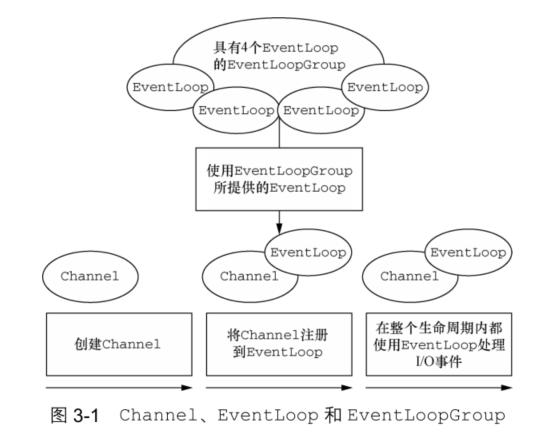

- 一个`EventLoopGroup`包括一个或多个`EventLoop`
- 一个`EventLoop`在它的生命周期内只和一个`Thread`绑定
- 所有由`EventLoop`处理的I/O事件都将在它专有的Thread上处理
- 一个`Channel`在它的生命周期内只注册于一个`EventLoop`
- 一个EventLoop可能会被分配给一个或多个`Channel`

#### 3. ChannelFuture接口

Netty 中所有的 I/O 操作都是异步的。因为一个操作可能不会立即返回，所以我们需要一种用于在之后的某个时间点确定其结果的方法。为此，Netty 提供了ChannelFuture 接口，其 addListener()方法注册了一个 ChannelFutureListener，以便在某个操作完成时（无论是否成功）得到通知。

#### 4. ChannelHandler接口

ChannelHandler充当了所有处理入站和出站数据的应用程序逻辑的容器。

例如将数据从一种格式转换为另外一种格式，或者处理转换过程中所抛出的异常。

#### 5. ChannelPipeline接口

ChannelPipeline 提供了 ChannelHandler 链的容器，并定义了用于在该链上传播入站和出站事件流的 API。当 Channel 被创建时，它会被自动地分配到它专属的 ChannelPipeline。

ChannelHandler安装到ChannelPipeline中的过程如下：

- 一个`ChannelInitializer`的实现被注册到了`ServerBootstrap`中
- 当 `ChannelInitializer.initChannel()`方法被调用时，ChannelInitializer将在 ChannelPipeline 中安装一组自定义的 ChannelHandler
- `ChannelInitializer` 将它自己从 `ChannelPipeline` 中移除

Netty应用程序入站和出站数据流

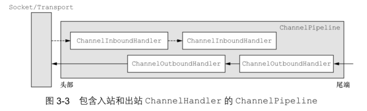

**入站**：一个入站消息被读取，那么它会从 ChannelPipeline 的头部开始流动，并被传递给第一个 ChannelInboundHandler。这个 ChannelHandler 不一定会实际地修改数据，具体取决于它的具体功能，在这之后，数据将会被传递给链中的下一个ChannelInboundHandler。最终，数据将会到达 ChannelPipeline 的尾端，届时，所有处理就都结束了。

**出站**：数据将从ChannelOutboundHandler 链的尾端开始流动，直到它到达链的头部为止。在这之后，出站数据将会到达网络传输层，这里显示为 Socket。通常情况下，这将触发一个写操作。

在Netty中，有两种发送消息的方式。

1. 你可以直接写到`Channel`中，将会导致消息从Channel-Pipeline 的尾端开始流动
2. 也可以 写到和Channel-Handler相关联的`ChannelHandlerContext`对象中，导致消息从 ChannelPipeline 中的下一个 Channel-Handler 开始流动

常用的适配器类

- `ChannelHandlerAdapter`: 处理入站和出站消息
- `ChannelInboundHandlerAdapter`: 处理入站消息
- `ChannelOutboundHandlerAdapter`: 处理出站消息
- `ChannelDuplexHandler`: 收发消息

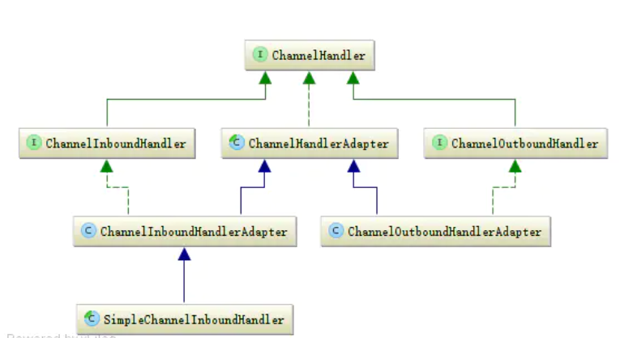

解码器：将netty接收的字节数组转成另一种格式，通常是一个Java对象

编码器：跟解码器相反，将一个对象转成字节数组

#### 6. 引导

Netty 的引导类为应用程序的网络层配置提供了容器，这涉及将一个进程绑定到某个指定的端口（服务器引导）

或者将一个进程连接到另一个运行在某个指定主机的指定端口上的进程（客户端引导）。

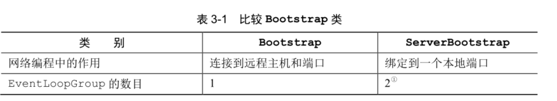

因为服务器需要两组不同的 Channel。第一组将只包含一个 ServerChannel，代表服务器自身的已绑定到某个本地端口的正在监听的套接字。而第二组将包含所有已创建的用来处理传入客户端连接（对于每个服务器已经接受的连接都有一个）的 Channel。

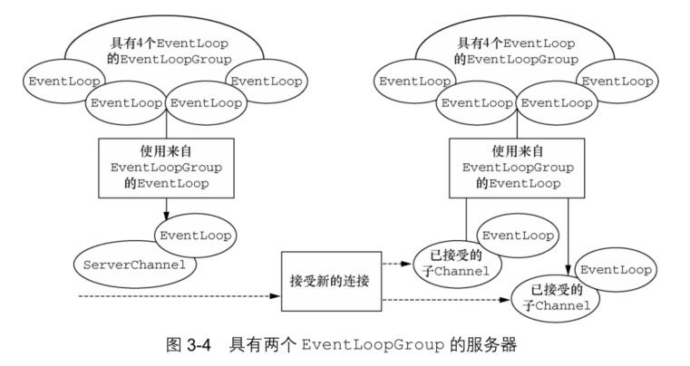

与 ServerChannel 相关联的 EventLoopGroup 将分配一个负责为传入连接请求创建Channel 的 EventLoop。一旦连接被接受，第二个 EventLoopGroup 就会给它的 Channel分配一个 EventLoop。

### Chapter4-传输

#### 1. 传输迁移

##### 1.1 未使用netty的OIO网络编程

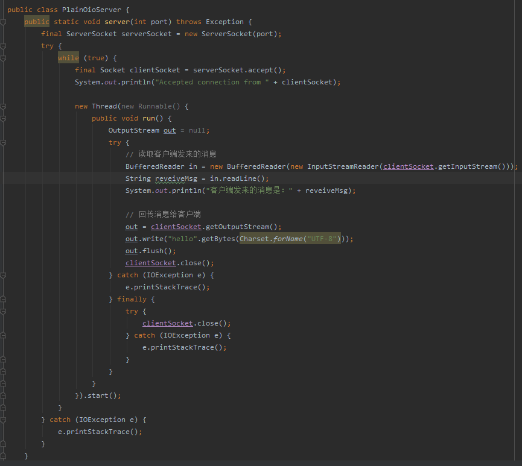

##### 1.2 未使用netty的NIO网络编程

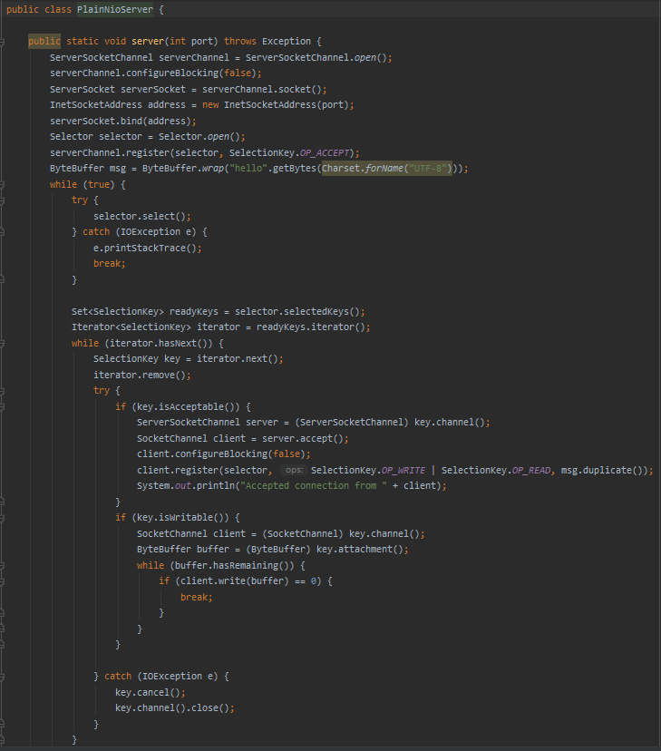

##### 1.3 使用netty的OIO网络编程

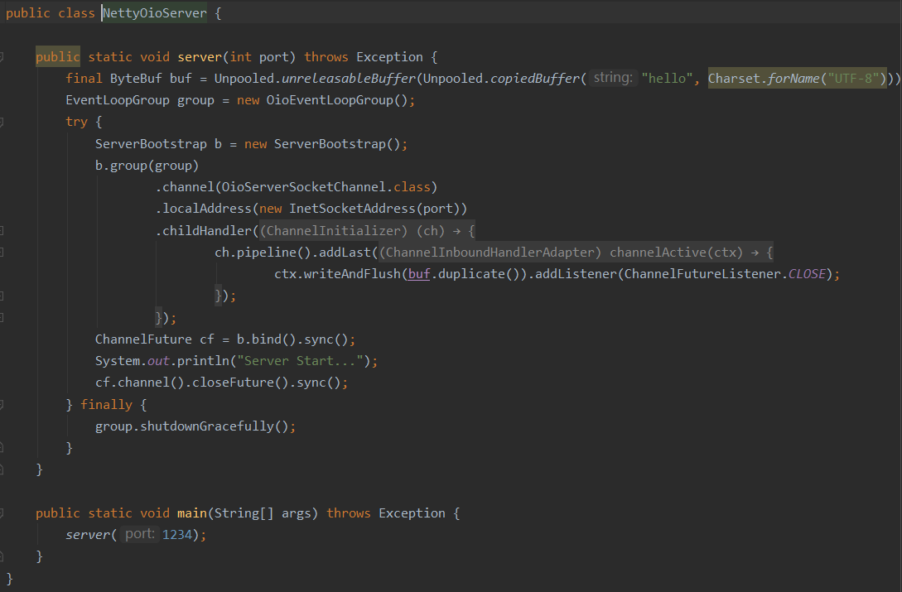

##### 1.4 使用netty的NIO网络编程

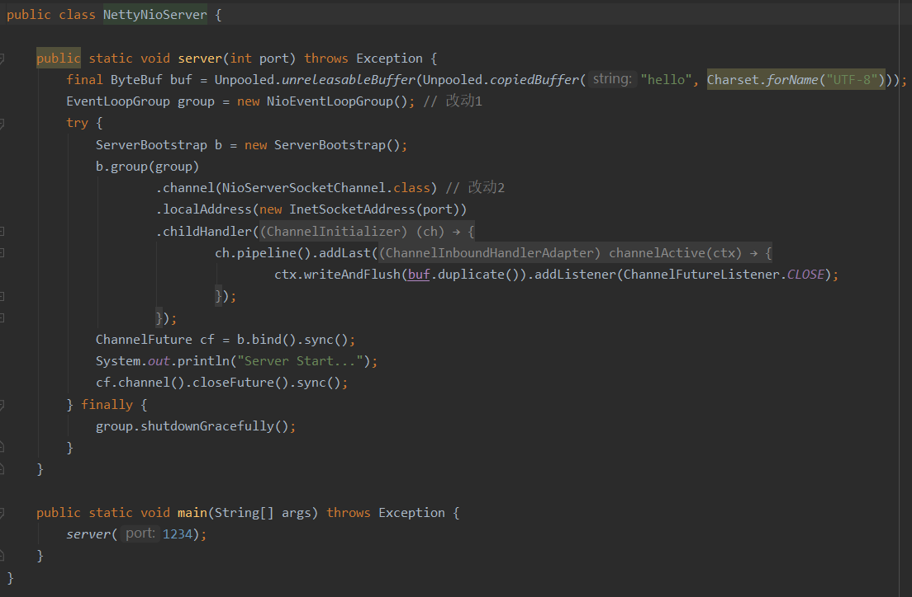

显而易见，java原生的OIO和NIO网络编程变化很大，复杂难用。但是netty的OIO和NIO网络编程，为每种传输的实现都暴露了相同的 API，所以无论选用哪一种传输的实现，你的代码都仍然几乎不受影响。

#### 2. 传输API

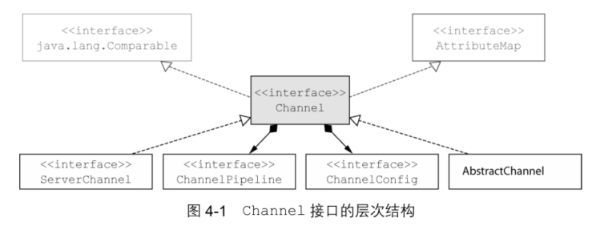

每个 Channel 都将会被分配一个 `ChannelPipeline` 和 `ChannelConfig`。

ChannelConfig 包含了该 Channel 的所有配置设置，并且支持热更新。

ChannelPipeline 持有所有将应用于入站和出站数据以及事件的 ChannelHandler 实例，这些 ChannelHandler 实现了应用程序用于处理状态变化以及数据处理的逻辑。

**ChannelHandler的典型用途：**

- 将数据从一种格式转成另一种格式
- 提供异常的通知
- 提供Channel变为活动或非活动的通知
- 提供当Channel注册到EventLoop或者从EventLoop注销时的通知
- 提供有关用户自定义事件的通知

**拦截过滤器**：ChannelPipeline 实现了一种常见的设计模式 — 拦截过滤器（Intercepting Filter）。UNIX 管道是另外一个熟悉的例子：多个命令被链接在一起，其中一个命令的输出端将连接到命令行中下一个命令的输入端。

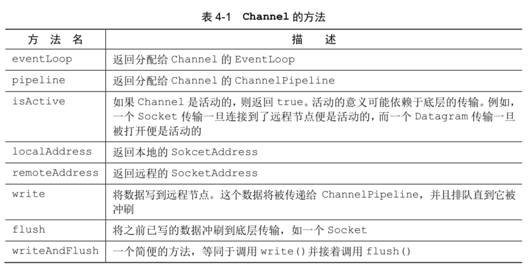

#### 3. 内置的传输

​																**Netty所提供的传输**

| 名称     | 包                          | 描述                                                         |
| -------- | --------------------------- | ------------------------------------------------------------ |
| NIO      | io.netty.channel.socket.nio | 使用 java.nio.channels 包作为基础——基于<br/>选择器的方式     |
| Epoll    | io.netty.channel.epoll      | 由 JNI 驱动的 epoll() 和非阻塞 IO。这个传输支持<br/>只有在Linux上可用的多种特性，如 SO_REUSEPORT ，<br/>比NIO 传输更快，而且是完全非阻塞的 |
| OIO      | io.netty.channel.socket.oio | 使用 java.net 包作为基础——使用阻塞流                         |
| Local    | io.netty.channel.local      | 可以在 VM 内部通过管道进行通信的本地传输                     |
| Embedded | io.netty.channel.embedded   | Embedded 传输，允许使用 ChannelHandler 而又<br/>不需要一个真正的基于网络的传输。这在测试你的<br/>ChannelHandler 实现时非常有用 |

##### 3.1 NIO-非阻塞I/O

NIO 提供了一个所有 I/O 操作的全异步的实现，选择器Selector充当一个注册表。

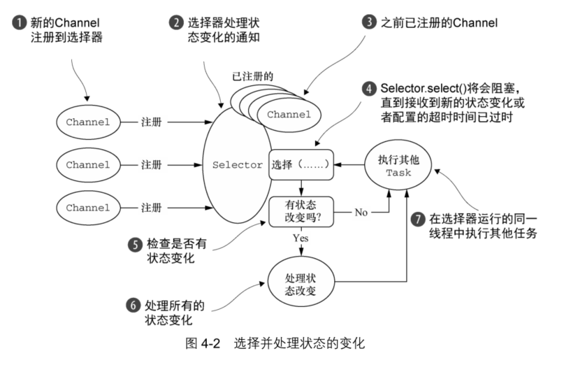

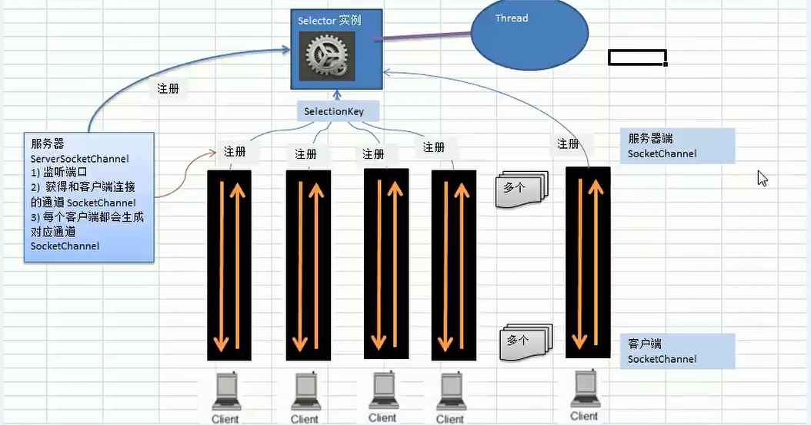

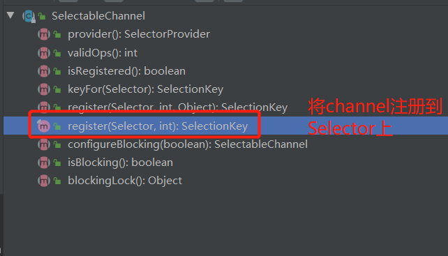

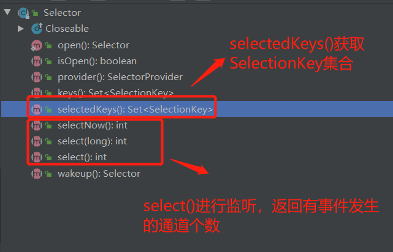

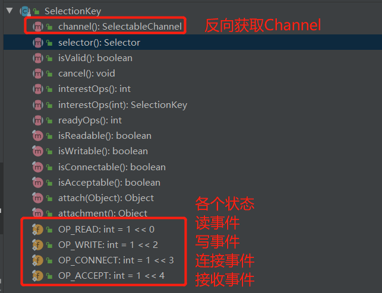

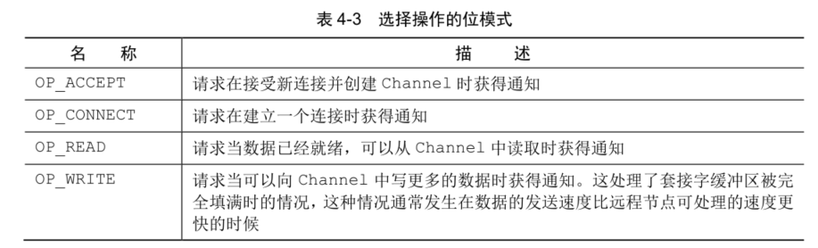


1. 当客户端连接时，会通过`ServerSocketChannel`得到`SocketChannel`
2. 将SocketChannel注册到`Selector`上，`register(Selector sel, int ops)`，一个Selector可以注册多个SocketChannel
3. 注册后返回一个SelectionKey，会和该Selector关联（集合）
4. Selector进行监听，`select()`，返回有事件发生的通道个数
5. 进一步得到各个`SelectionKey`(有事件发生时)
6. 在通过SelectionKey的`channel()`反向获取SocketChannel
7. 可以通过得到的channel，完成业务处理

##### 3.2 Epoll — 用于 Linux 的本地非阻塞传输

**高负载下性能更佳，优于JDK的NIO实现**

Linux作为高性能网络编程的平台，其重要性与日俱增，这催生了大量先进特性的开发，其中包括**epoll——一个高度可扩展的I/O事件通知特性**。这个API自Linux内核版本 2.5.44（2002）被引入，提供了比旧的POSIX select和poll系统调用更好的性能，同时现在也是Linux上非阻塞网络编程的事实标准。

##### 3.3 OIO — 旧的阻塞 I/O

Netty 的 OIO 传输实现代表了一种折中：它可以通过常规的传输 API 使用，但是由于它是建立在 java.net 包的阻塞实现之上的，所以它不是异步的。

Netty是如何能够使用和用于异步传输相同的API来支持OIO的呢？
答案就是，Netty利用了SO_TIMEOUT这个Socket标志，它指定了等待一个I/O操作完成的最大毫秒数。如果操作在指定的时间间隔内没有完成，则将会抛出一个SocketTimeout Exception。Netty将捕获这个异常并继续处理循环。在EventLoop下一次运行时，它将再次尝试。

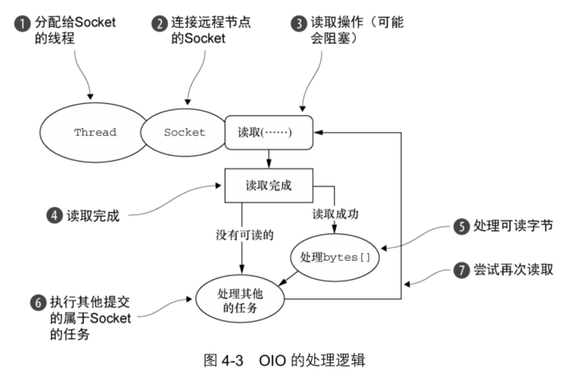

#### 4. 传输的用例

​																				**应用程序的最佳传输**

| 应用程序的需求                 | 推荐的传输                  |
| ------------------------------ | --------------------------- |
| 非阻塞代码库或者一个常规的起点 | NIO(或者在Linux上使用Epoll) |
| 阻塞代码库                     | OIO                         |
| 在同一个JVM内部的通信          | Local                       |
| 测试ChannelHandler的实现       | Embedded                    |

