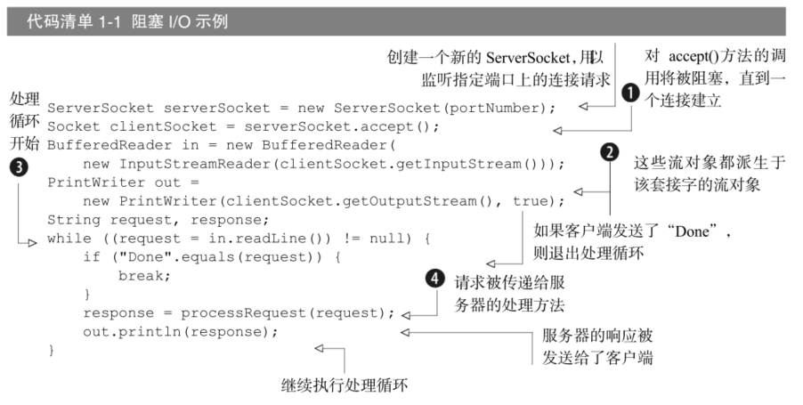
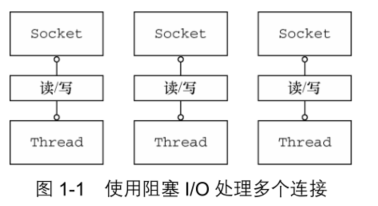
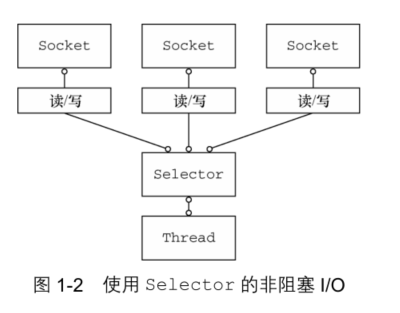
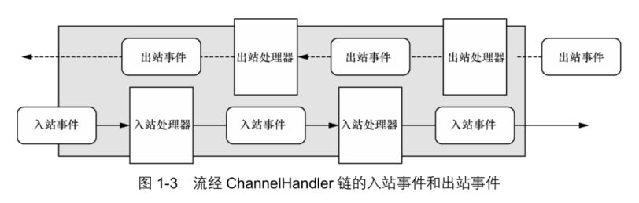
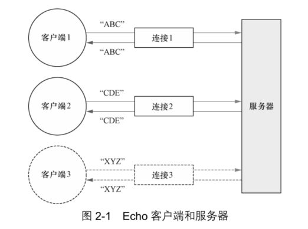
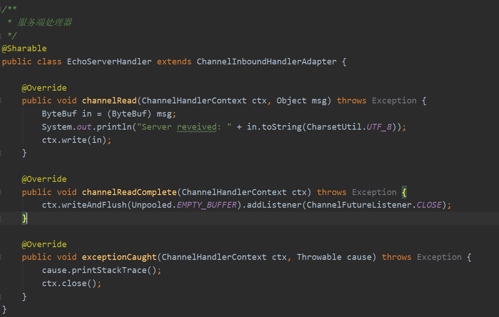
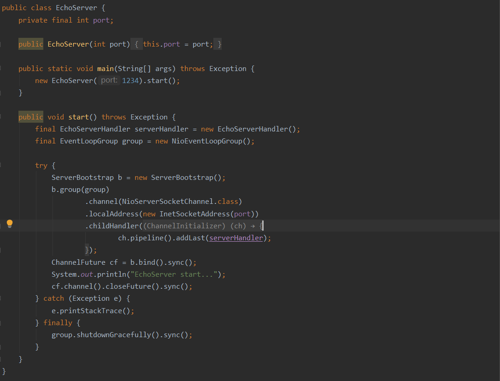
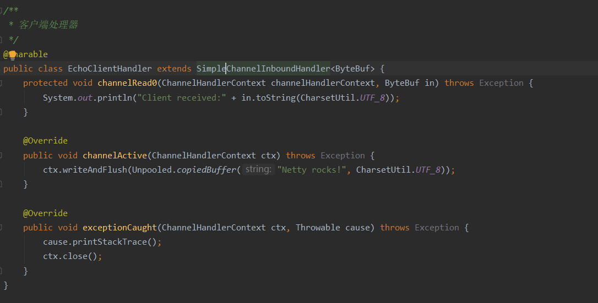
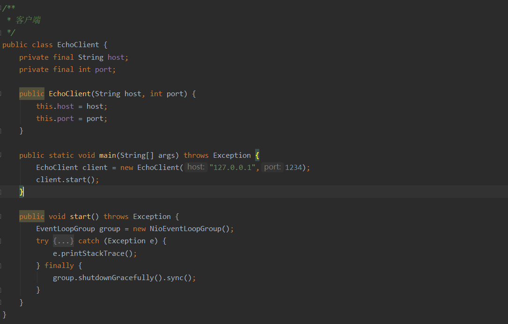

# Netty学习

### Chapter1-异步和事件驱动

#### 1.什么是Netty?

Java网络编程提供的原生API复杂难用，而Netty将这些复杂难用的API接口优化封装，提供给我们简单易用的API接口。一句话，用较简单的抽象隐藏底层实现的复杂性。

Java原生API示例



是阻塞的，一个连接创建一个线程，效率低，最主要的是线程多了，上下文切换的开销很大




Netty使用了Java NIO，避免了以上问题



使用较少的线程便可以处理许多连接，因此也减少了内存管理和上下文切换所带来开销；

当没有 I/O 操作需要处理的时候，线程也可以被用于其他任务。

#### 2.Netty优点

- 统一的 API，支持多种传输类型，阻塞的和非阻塞的
- 易于使用
- 拥有比 Java 的核心 API 更高的吞吐量以及更低的延迟
- 完整的 SSL/TLS 以及 StartTLS 支持
- ...

#### 3.异步和事件驱动

异步：for example，你在煮饭的同时，可以做菜，并发进行

事件驱动：for example，点击登录，进入网页，是由点击事件触发

#### 4.Netty核心组件

- Channel：可以看作是传入（入站）或者传出（出站）数据的载体
- 回调：其实就是一个方法，一个指向已经被提供给另外一个方法的方法的引用。这使得后
  者可以在适当的时候调用前者。
- Future：可以看作是一个异步操作的结果的占位符；它将在未来的某个时刻完成，并提供对其结果的访问。
- 事件：Netty使用不同的事件来通知我们状态的改变或者是操作的状态，让我们在已经的事件触发适当的动作。比如数据读取的时候，打印一个“hello world”
- ChannelHandler：处理器，针对特定的事件执行特定的动作




事件被分发给ChannelHandler类中的方法，Netty处理链可以对事件进行过滤筛选，执行相应的动作。


### Chapter2-你的第一款Netty应用程序

#### 1.Netty客户端和服务端示意图

实现功能：客户端发啥消息，服务端返回同样的消息，体现**请求-响应交互模式**



#### 2.编写Echo服务器

- ChannelHandler: 处理客户端发送数的据，及业务逻辑

- 引导：配置服务器的启动代码

  很好体现了**解耦**思想，将业务逻辑与网络处理代码分离，分成两部分

##### 2.1 ChannelHandler和业务逻辑

- channelRead() : 对于每个传入的消息都要调用
- channelReadComplete() : 通知ChannelInboundHandler最后一次对channelRead()的调用是当前批量读取中的最后一条消息
- exceptionCaught() :  在读取操作期间，有异常抛出时会调用

**EchoServerHandler**



ChannelInboundHandlerAdapter 有一个直观的 API，并且**它的每个方法都可以被重写以挂钩到事件生命周期的恰当点上**

##### 2.2 引导服务器

- 绑定监听端口，并接受传入的连接请求
- 配置 Channel ，以将有关的入站消息通知给 EchoServerHandler 实例

**EchoServer**



- 创建一个```ServerBootstrap```的实例以引导和绑定服务器

- 创建并分配一个```NioEventLoopGroup```实例以进行事件的处理，如接受新连接或读写数据
- 指定服务器绑定的本地的 ```InetSocketAddress```
- 使用一个 ```EchoServerHandler ```的实例初始化每一个新的 Channel
- 调用 ```ServerBootstrap.bind()```方法以绑定服务器

#### 3. 编写Echo客户端

##### 3.1 ChannelHandler和业务逻辑

- channelActive(): 在与服务器的连接建立之后被调用
- channelRead0(): 当从服务器接收到一条消息时被调用
- exceptionCaught(): 在处理过程中引发异常时被调用

**EchoClientHandler**



##### 3.2 引导客户端

**EchoClient**



- 为初始化客户端，创建了一个``` Bootstrap ```实例
- 为进行事件处理分配了一个``` NioEventLoopGroup ```实例，其中事件处理包括**创建新的连接以及处理入站和出站数据**
- 为服务器连接创建了一个 ```InetSocketAddress ```实例
- 当连接被建立时，一个 ```EchoClientHandler``` 实例会被安装到（该 Channel 的）```ChannelPipeline``` 中
- 在一切都设置完成后，调用 ```Bootstrap.connect()```方法连接到远程节点

